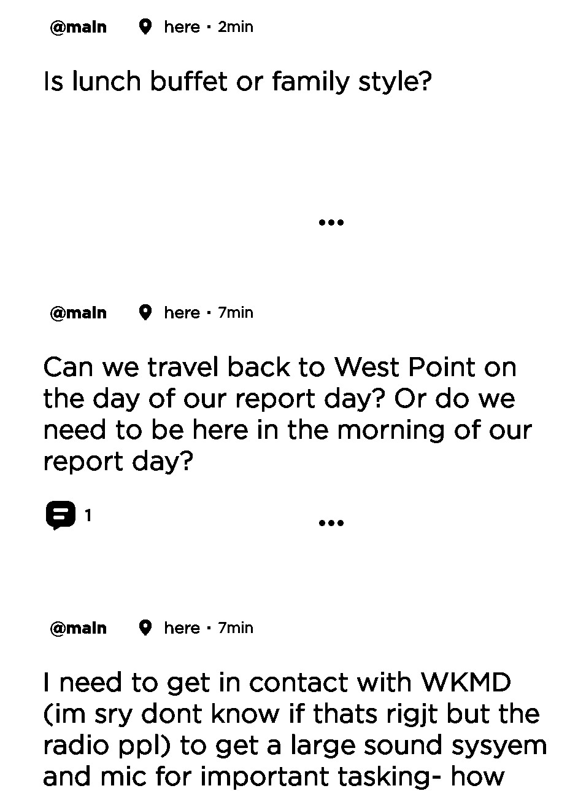
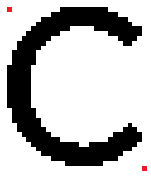

# Jodel_OCR

### This repository is intended to be used as a better alternative to well known commercial OCRs such as Pytesseract for the mobile app Jodel because they do not work very well on this app.
\
\
This repository is a continuation of a capstone project that I worked on. Currently this is comprised of a lot of spaghetti code. At the moment I have no immediate intention of optimizing the code; however, **I might make the code more readable and create minimal optimizations if there is some interest in the repository. Please leave a message if you are inerested.**

## Requirements
* Android Debugging Bridge (adb library)
* Libraries: open_cv, subprocess, numpy, time, and networkx
* Galaxy S9 Android Phone (the bitmaps only work on this type of phone currently)
* Jodel App

To run the program:

    python DataofData.y

## Overview

The scraper automatically refreshes the phone and takes a screenshot of the phone screen through the subprocess library. The image is then converted into a black and white image. 

(I know the file doesn't exist. I'm too lazy to delete this.)


Raw Image


Black and White Image

A function figures out where each line of text is located. Each line of text is then converted into a graph where each black pixel is a node (y,x) and adjacent black pixels are represented as edges between these nodes. Utilizing a BFS search function, each individual graph representing a character is seperated from the large graph of nodes and edges.

A problem arises for characters that have markings that are not apart of the main body or have multiple disconnected markings will not be a part of the same graph. These characters include: 
    
    "i", ";", "?", "j", "%", "!", " \\" " 

To solve this issue, the average x-coordinate value is calculated for every graph. The graphs are ordered by x-value and then the adjacent graphs wil be compared by their averaged x-values and combined if they are close enough. To get the bitmaps from the graphs we need to normalize each node. Since each node is represented as a tuple by (y,x) we need to normalize these values by subracting each value by the smallest x and y value. Each node becomes (y - y<sub>min</sub>, x - x<sub>min</sub>). This gives us coordinate values between 0 and x<sub>max</sub> or y<sub>max</sub>. 

Each normailized graph is compared against its known/previously seen bitmap (located in AlphabetSoup.py). Each bitmap is held within a list in a dictionary datastructure. The masker_key variable is the list of all characters. That list is iterated through until a match is found above the confidence level or no matches are found. *This portion could be optimized by utilizing a decision tree. I don't know how to do this (yet).* Each line of characters are concatenated until the last line is found and the entire string (Jodel Post) is returend. 

### Optimizations for the OCR Scraper

One of the biggest things that I could do is transfer the method from Custom_OCR.py to the DataofData.py. This will ensure that Custom_OCR.py is only used for finding bitmaps, and DataofData.py is only used for scraping posts. These methods were left over from an older prototype and they could easily be centralized to one script file:
* Find_Dictionary
* Find_Line
* ScreenShot
* Process_Image
* Merge_Sort

Also, integrating a way to automatically identifying unknown graphs and having the user type in what character is being looked at so that the program can automatically add the bitmap the the dictionary would be something cool to add. I might actually want to do this.

## Creating Bitmaps
This is the portion that involves the most spaghetti code and most outrageously complex method to solve. If there is anything that needs optimizing (or any logical and easy to understand method) is this portion.

Whenever a screenshot is taken and processed, it is saved into the local directory as "processed_image." My original method was by opening paint and zooming into 800% magnification. From here, we can choose which character to focus and here we are looking at the character "C". I've marked the top left and bottom right with red pixels. In this example the top left red pixel is in-line with the pixels of the character. The bottom right red pixel is just below the lowest and right most black pixel.



    The coordinates of each red pixel is recorded.
    
    |Pixel|Coordinates|
    |-----|-----------|
    |Top-Left|(72, 580)|
    |Bottom-Right|(100, 613)|

Once the pixel coordinates are found, they are then input into the (x<sub>1</sub>, x<sub>2</sub>) and (y<sub>1</sub>, y<sub>2</sub>) variables in lines 379 and 380 of Custom_OCR.py as seen below.

```Python
#Code used to map black pixels of letters
test = 0
if(test == 1):
    img = cv2.imread('processed_image.png')
    #img = cv2.resize(img, (400, 450))

    #white = [255,255,255]
    WHITE = [255,255,255]
    #black = [0,0,0]
    BLACK = [0,0,0]

    #IMPORTANT!
    #Change these values to get bitmap of letter
    y1, y2 = 164, 202
    x1, x2 = 623, 646
    num_rows, num_columns = y2 - y1, x2 - x1

    #img[(range y),(range x)]
    cropped_image = img[y1:y2, x1:x2]
    pixels = []
    tmp = ""
    for i in range(num_rows): # rows
        for j in range(num_columns): # columns
            
            if((cropped_image[i][j] == WHITE).all()):
                tmp += "/"
            else:
                tmp += "0"
                pixels.append((i,j))
        print(tmp)
        tmp = ""
    #cv2.imshow('image',cropped_image)
    #cv2.waitKey(0)
    print(pixels)
    print((num_rows, num_columns))
```

Once these coordinate values are updated and the test variable is changed to 1,you can run Custom_OCR.py by itself. This will output an ASCII representation of the character, a bitmap of the black pixels in the form of a list, and the dimentions of the character (y,x).

**Be warned! You will probably need more than one bitmap per character to ensure that it can read the given character everytime. There is random noise that can disrupt the accuracy of the bitmap comparisons.**

### Possible Optimizations to Creating Bitmaps
\
To optimize this portion we could just print the normalized graphs that we already created. I actually implemented this in a very crude way by printing the graph right before it was deleted from the list of graphs. In the code below it is represented by the commented code of ```#print(edge_bfs)``` in DataofData.py file.

```Python
#function
#Remove the last set of 
def Remove_BFS(graph):
    #remove edges
    thing = list(graph.edges)[0][0]
    edge_bfs = list(nx.edge_bfs(graph, source=thing))
    # print(edge_bfs)
    # print()
    
    #remove_edges = [e for e in graph.edges if e in edge_bfs]
    for i in edge_bfs:
        graph.remove_edge(i[0],i[1])
    #graph.remove_edges_from()
```
Yes, I acknowledge that this is way better to do; however, my code only looks at one line at a time and the bitmaps can get very long. This will create very large outputs and get very confusing and cluttered on the command prompt very quickly. 
